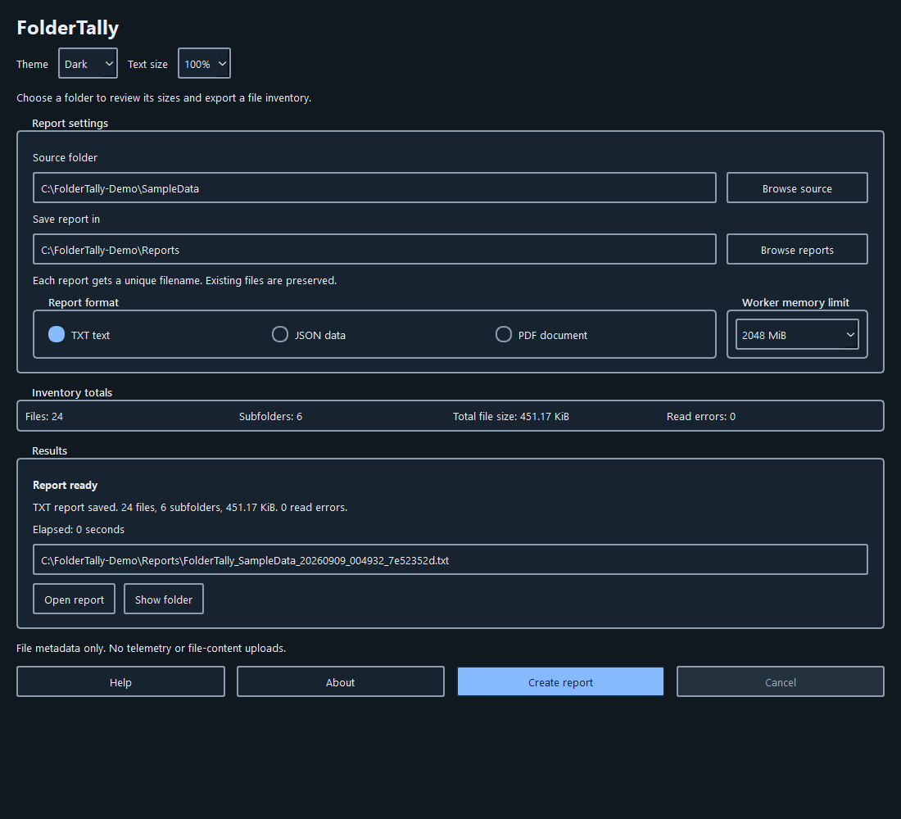
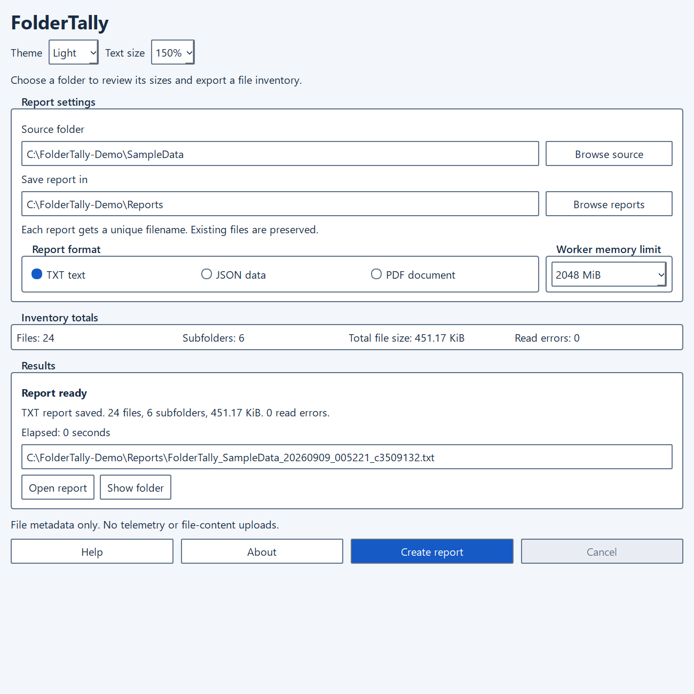

# FolderTally

FolderTally is a Windows folder size analyzer and recursive file inventory tool with a desktop interface and command line. It calculates directory totals and exports TXT, JSON, and PDF reports without reading file contents. Totals describe file sizes, not physical disk allocation.



## Portable desktop

Extract the entire `FolderTally-v1.0.0-windows-x64.zip` into a writable folder, then run `FolderTally.exe`. Keep its `_internal` runtime folder and other included files together; the EXE alone is not the application. No installation, administrator rights, or separate Python runtime is needed. The EXE is unsigned, so Windows may show an unknown-publisher warning. Checksums are included in `SHA256SUMS.txt`.

Choose a source folder, an existing report destination, a format, and a worker memory limit. Select Create report. Cancel or Escape stops the scan after the current file operation.

The window opens centered on its last-used monitor. Choose System, Light, or Dark from Theme. Windows high contrast takes priority. Theme and text size are remembered between launches. Publisher and license details are in About.

Tab and Shift+Tab navigate controls. Alt+S focuses the source, Alt+I the destination, Alt+C creates a report, and F1 opens help. Use Text size or Ctrl+Plus, Ctrl+Minus, and Ctrl+0 to enlarge or reset text. Content scrolls as needed, and keyboard focus brings the active control into view.

Closing an idle app exits immediately. During a scan, the app asks before cancelling and waits for the worker to finish cleanup.

The interface exposes named controls and status announcements through Windows accessibility APIs. See [accessibility status and limitations](ACCESSIBILITY.md) for testing evidence and outstanding human checks. Full Section 508 / WCAG 2.1 AA conformance has not been established.

Desktop reports get unique filenames; existing files are preserved. PDF generation is bundled and does not use a browser or printer.



## Command line

The original CLI remains available as `FolderTally.py`. It uses Python's standard library.

```powershell
python FolderTally.py "D:\Projects"
python FolderTally.py "D:\Projects" --format json --output "D:\Reports"
python FolderTally.py "D:\Projects" --format txt --output "D:\Reports\inventory.txt" --ram-cap-mb 512

```

| Option | Meaning |
| --- | --- |
| `target` | Folder to inventory. |
| `-f`, `--format` | `txt`, `json`, or `pdf`. Default: TXT. |
| `-o`, `--output` | Existing report folder or a complete filename. Default: Downloads. |
| `--ram-cap-mb` | Worker/process memory ceiling, 256 to 2048 MiB. Default: 2048. |
| `--no-hard-cap` | CLI only: disable the Windows Job Object memory ceiling. |
| `--overwrite` | CLI only: explicitly permit replacement of the selected output file. |
| `-h`, `--help` | Show command-line help. |

The CLI's legacy PDF route uses Microsoft Print to PDF, with Microsoft Edge as a fallback. The desktop PDF renderer is separate; its accessibility changes do not apply to legacy CLI PDFs.

## Report contents

Reports include relative paths, entry types, individual sizes, accumulated folder sizes, extensions, inferred MIME types, scan errors, and summary counts. MIME and encoding fields come from filename-based MIME lookup, not content inspection.

JSON exposes these values in an `entries` array. TXT is useful for searching and reviewing an inventory. Desktop PDFs use PDF 1.7, embedded fonts, document language, ordered text tags, and PDF/UA-1 identification metadata. Representative reports pass veraPDF's PDF/UA-1 machine checks; human reading-order and screen-reader review remains necessary. Filenames outside the embedded font's character coverage use Unicode escapes in PDF; TXT and JSON preserve the original characters.

Symbolic links, junctions, and other reparse points detected during a scan are listed without traversing their targets. Fresh checks around directory opening reject detected reparse, containment, and identity changes. These path-based checks are not a security boundary against an adversary concurrently replacing directories or ancestors. Do not scan actively hostile trees. Hard-linked entries are counted individually.

## Limits and privacy

A scan reflects the current account's permissions. Read errors mean the inventory may be incomplete. Files can change during scanning; reports are not filesystem snapshots.

The scanner uses a temporary disk-backed inventory. Report generation, particularly PDF tagging, can require additional memory. Use TXT or JSON for very large trees. Cancellation waits for the current Windows file operation; forced termination or power loss can leave temporary files.

The desktop stores only the monitor identifier, theme, and text size at `%LOCALAPPDATA%\PradaFit\FolderTally\window.json`. It does not retain scan paths or report history. If the previous monitor is unavailable, it uses the monitor under the pointer, then the primary display. Portable does not mean zero-trace: preferences, reports, and temporary scan files are written locally. Reports contain filenames and folder names; review them before sharing. No telemetry, automatic updates, or account sign-in is included.

## Development and license

Run the desktop from source with Python and the packages in `requirements.txt`. The CLI itself uses only the standard library.

```powershell
python -m venv .venv
.\.venv\Scripts\python.exe -m pip install -r requirements.txt
.\.venv\Scripts\python.exe FolderTallyGUI.py
.\.venv\Scripts\python.exe -m unittest discover -s tests -v
```

For packaging, use Windows x64, Python 3.14.7, and separate `.build-venv` and `.package-venv` environments containing `requirements-build.txt`. Run `tools/fetch_qt_sources.py` once to obtain the hash-pinned library sources, then `Build-Portable.ps1`. Each build creates a new timestamped directory under `dist`. See [library replacement and rebuild instructions](packaging/LIBRARY_REPLACEMENT.md).

Copyright (C) 2026 PradaFit. The current first-party FolderTally source is source-available under the [FolderTally Noncommercial License](LICENSE), with separate commercial licensing available from PradaFit. Personal use and noncommercial education/research are free. Business use, paid integration, commercial hosting, rebranding/resale, and OEM distribution need a separate agreement. Royalties, if any, are negotiated OEM terms, not an automatic fee. Earlier GPL-licensed copies keep their existing rights. Third-party libraries keep their own licenses; see [THIRD_PARTY_NOTICES.md](THIRD_PARTY_NOTICES.md).
